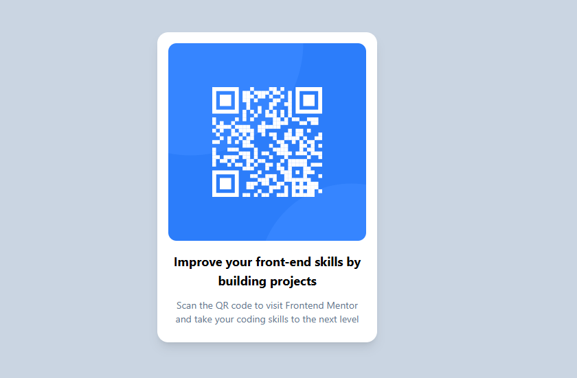

# 🧩 Proyecto: Componente QR Code

Este proyecto consiste en el desarrollo de un **componente de Código QR** utilizando **Astro** y **Tailwind CSS**.  
El objetivo es aplicar los conocimientos sobre **componentes**, **maquetación**, **estilos responsivos** y **utilidades CSS** para construir un diseño limpio, moderno y adaptable a diferentes dispositivos.

---

## 📖 Descripción general

### 🧩 Vista previa del proyecto
Agrega aquí una **captura de pantalla** del resultado final de tu componente.  
> Puedes usar la herramienta de captura del navegador o cualquier software de tu preferencia.

 ![alt text]

---

### 🔗 Enlaces del proyecto

- **Repositorio en GitHub:** [https://github.com/froilan07botello-afk/QR-CODE-COMPONENT.git]
- **Sitio desplegado (opcional):** [https://qr-code-component-dun-three.vercel.app/]

---

## 🧠 Proceso de desarrollo

### 🛠️ Tecnologías utilizadas
Lista las herramientas y tecnologías que utilizaste en el proyecto. Por ejemplo:

- [Astro](https://astro.build)
- [Tailwind CSS](https://tailwindcss.com/)
- HTML5 semántico
- Diseño responsivo (Mobile-first)
- Componentes reutilizables

---

### 💡 Lo que aprendí
En esta sección describe brevemente **qué aprendiste o reforzaste** al desarrollar este proyecto.  
Puedes incluir fragmentos de código o mencionar conceptos nuevos que aplicaste.

En general comprendi mejor como es que funciona el framework ya que no me quedaba muy claro su funcionamiento, en si es muy similar a como desarrollabamos las paginas con html y css puro, solo
cambia un poco por el tema de los componentes y la manera en que hay que importarlos para poder usarlos
pero si te facilita mucho las cosas pues puedes reutilizar codigo y ser mas dinamico y rapido para desarrollar paginas web.

---

### 🚀 Áreas de mejora

Menciona aquí los aspectos que podrías mejorar o seguir practicando en futuros proyectos.

**Ejemplo:**
- Mejorar el manejo del responsive en pantallas pequeñas.  
- Implementar animaciones o transiciones suaves.  
- Explorar el uso de variables de Tailwind personalizadas y el hecho de saber aplicar lo de mapear informacion como lo practicamos con un ejercicio en clase.  
- Optimizar la estructura del proyecto y el uso de componentes.  
- Aprender bien el valor de ciertas propiedades que ya no estan por ejemplo en px si no es una conversion de unidad o algo asi entoces se me dificultaba un poco.

---

### 📚 Recursos útiles

Incluye los enlaces, documentación o tutoriales que te ayudaron a completar este proyecto.

**Ejemplo:**
- [Documentación de Astro](https://docs.astro.build)  
- [Guía oficial de Tailwind CSS](https://tailwindcss.com/docs)  
- [MDN Web Docs - HTML y CSS](https://developer.mozilla.org/es/)  
- [Guía de diseño responsivo](https://web.dev/responsive-web-design-basics/)  

---

### 👩‍💻 Autor

- **Nombre completo:*Arturo Froilán Rodríguez Botello*  
- **Carrera:*ING TICS*  
- **Grupo:**  
- **Correo institucional:*23151314@aguascalientes.tecnm.mx*  

---

### ✨ Reflexión final

Comparte brevemente tu experiencia durante el desarrollo del proyecto.  
Puedes responder a preguntas como:

- ¿Qué fue lo más fácil o lo más difícil de realizar? 
lo mas dificil para mi fue aprender el funcionamiento del framework y porque es que funciona asi, al igual que el cambio en las unidades de medidas de algunas propiedades. 
- ¿Qué parte disfrutaste más del desarrollo?  
De inicio que comenzamos con el framework no le veia la "facilidad" que mencionaban pero en ejercicios posteriores me di cuenta que si es muy facil para desarrollar y de comprender en comparacion con otros frameworks.
- ¿Qué conceptos nuevos aprendiste?  
El uso de un framework, implementacion de componentes.
- ¿Cómo aplicarías lo aprendido en proyectos futuros?
Pues podria implementarse en proyectos que sabemos que su contenido no tendra demasiados cambios constantemente y que no incluye codigo de js, solo lo necesario, seria util para landing pages, cosas que no tengan bases de datos por ejemplo.
